# ☁️ Simple EC2 Monitoring with CloudWatch ⌚

This project walks through setting up a basic Amazon EC2 instance and monitoring its CPU utilization using **Amazon CloudWatch**. You’ll create an alarm that triggers when CPU usage exceeds 15%, generate stress on the instance, and observe CloudWatch in action.

---

## 📋 Prerequisites

- AWS account
- IAM user with EC2 and CloudWatch permissions
- AWS CLI configured (optional)
- Basic knowledge of EC2 and Linux commands

---

## 🚀 Steps Overview

1. Launch a t2.micro EC2 instance in the default VPC with a public IP.
2. Connect to the instance and install required packages.
3. Create a CloudWatch alarm to monitor CPU usage.
4. Generate CPU load using `stress`.
5. Observe the CloudWatch alarm trigger and reset.
6. Clean up AWS resources.

---

## 🖥️ EC2 Setup

- **Instance Type**: `t2.micro`
- **VPC**: Default
- **Public IP**: Enabled
- **Monitoring**: Detailed monitoring (optional, small fee may apply)

---

## 🔧 Instance Configuration

SSH into your EC2 instance, then run:

```bash
sudo yum install stress -y
stress -c 1 -t 3600
```

## Steps

 1. Configure EC2 instance and Create CloudWatch security group

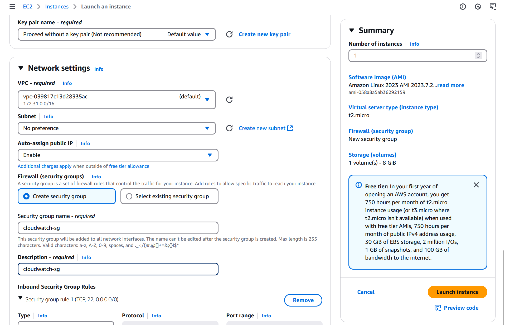
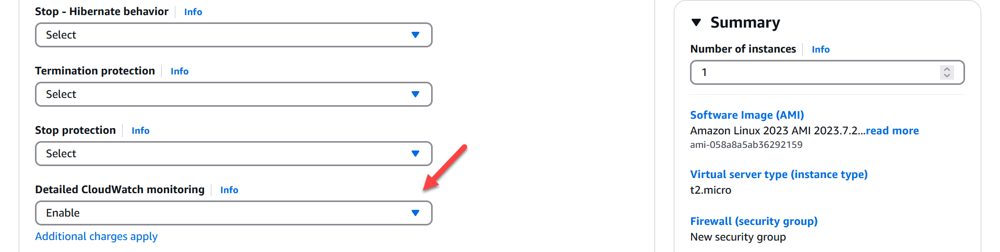
 
 
 2. Verify EC2 instance and make sure it clears status checks

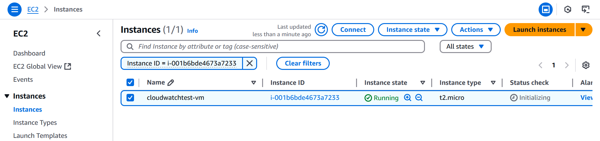

 3. Configure CloudWatch Alarm

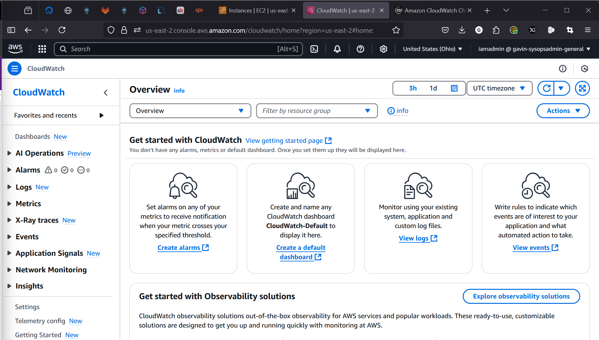

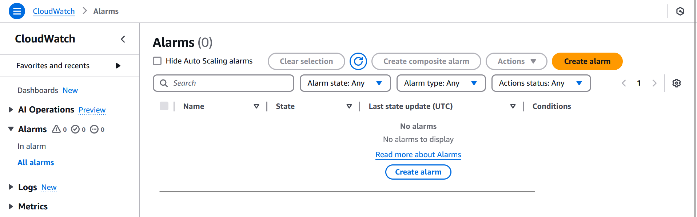

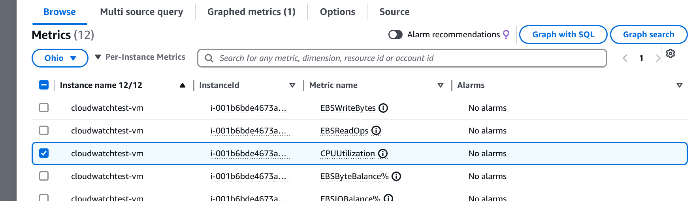

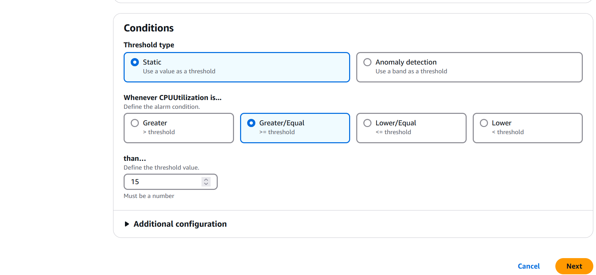

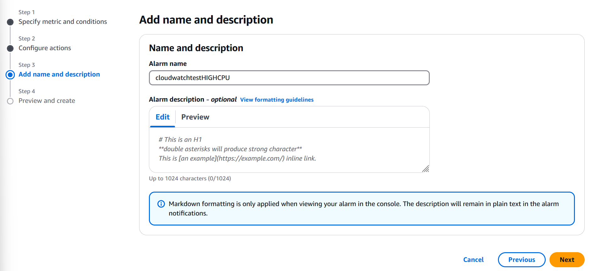

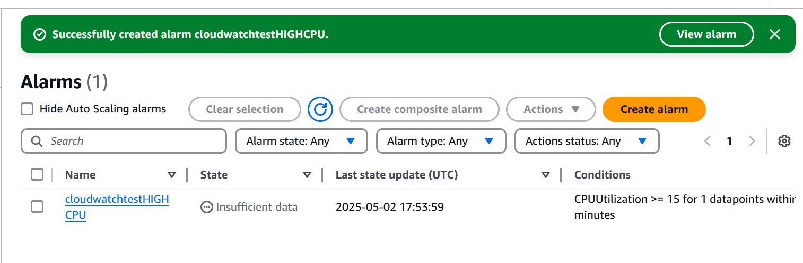


 4. Connect to EC2 Instance (In this scenario, I used EC2 Instance Connect)

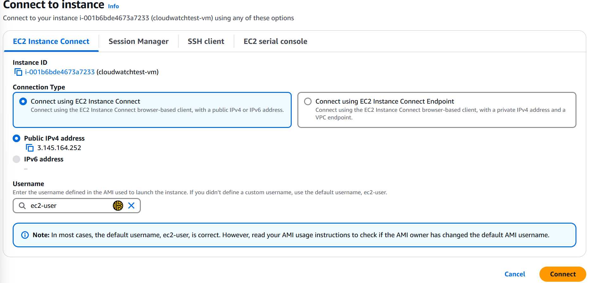

 5. Install the stress package

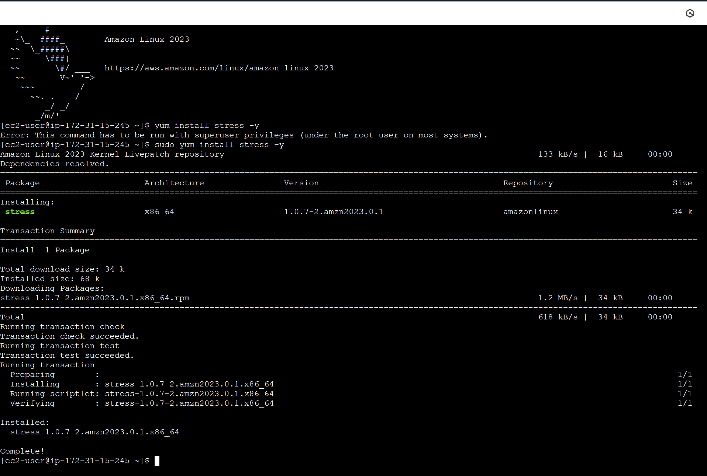

The alarm is currently in a 'OK' state

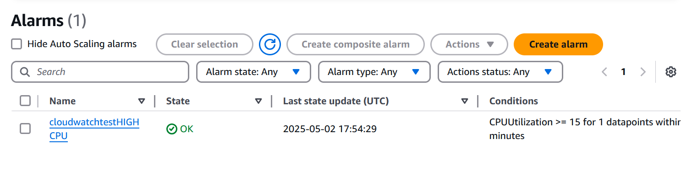

 6. Pre-CPU stress. The CPU utilization right now is showing the stress install

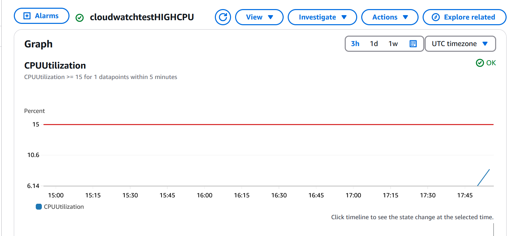

 6. Run stress from EC2 instance. After a couple minutes the state will move from 'OK' to 'In Alarm'

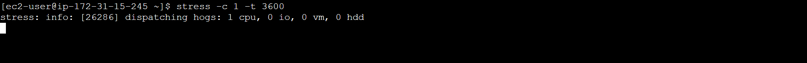

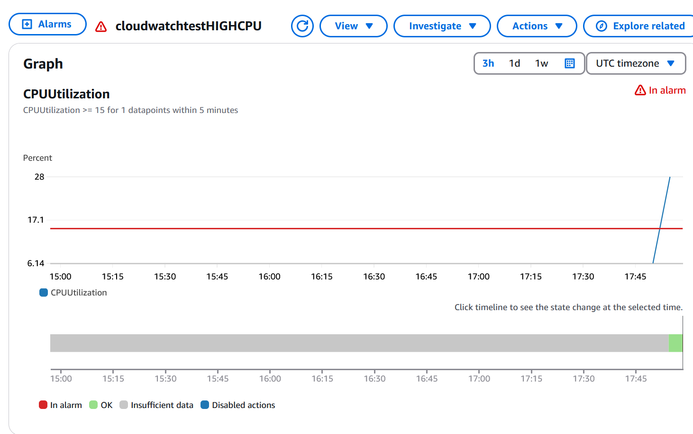

 7. Stop the stress program and monitor CloudWatch. It should be move back to 'OK' after several minutes.

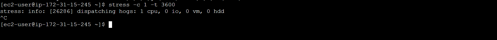

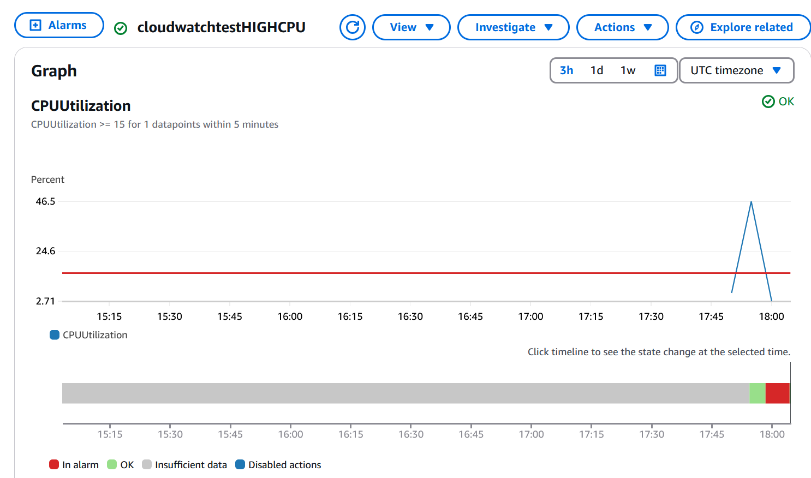

 8. Cleanup resources (Delete CloudWatch alarm, EC2 Instance and CloudWatch Security Group)

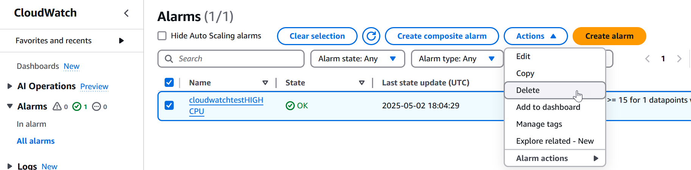

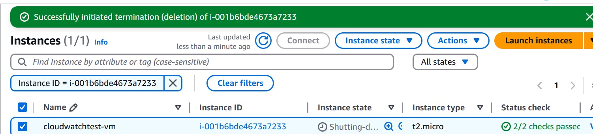

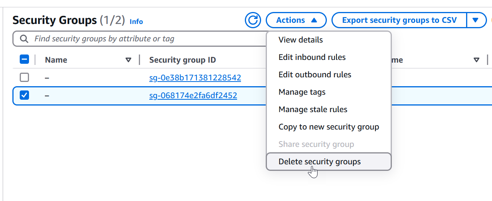
